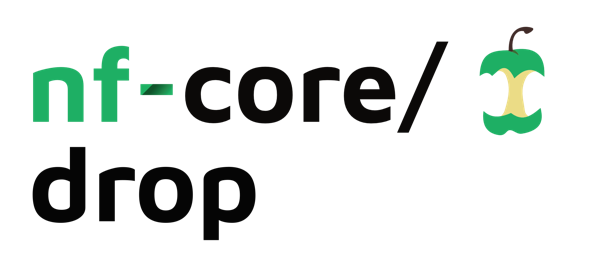
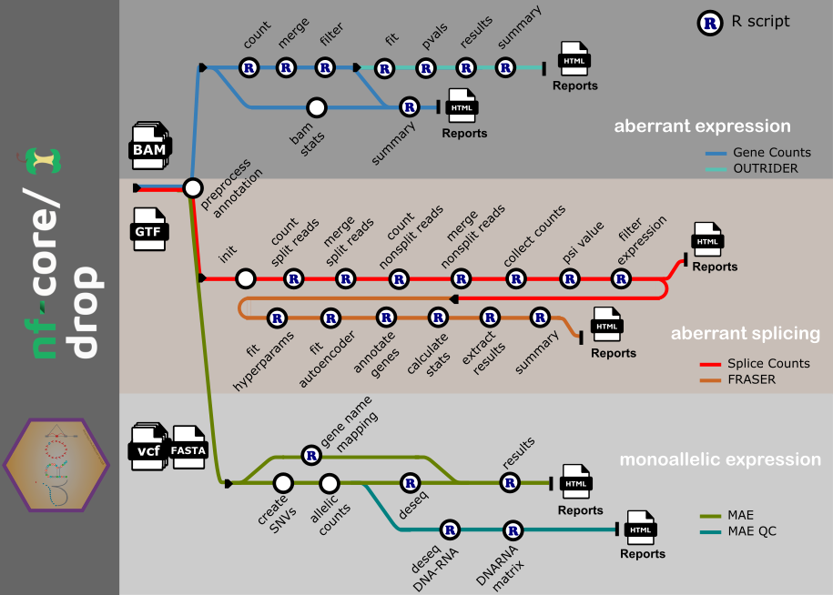

<h1>
  <picture>
    <source media="(prefers-color-scheme: dark)" srcset="docs/images/nf-core-drop_logo_dark.png">
    
  </picture>
</h1>

[](https://github.com/codespaces/new/nf-core/drop)
[](https://github.com/nf-core/drop/actions/workflows/nf-test.yml)
[](https://github.com/nf-core/drop/actions/workflows/linting.yml)[](https://nf-co.re/drop/results)[](https://doi.org/10.5281/zenodo.XXXXXXX)
[](https://www.nf-test.com)

[](https://www.nextflow.io/)
[](https://github.com/nf-core/tools/releases/tag/3.5.1)
[](https://docs.conda.io/en/latest/)
[](https://www.docker.com/)
[](https://sylabs.io/docs/)
[](https://cloud.seqera.io/launch?pipeline=https://github.com/nf-core/drop)

[](https://nfcore.slack.com/channels/drop)[](https://bsky.app/profile/nf-co.re)[](https://mstdn.science/@nf_core)[](https://www.youtube.com/c/nf-core)

## Introduction

**nf-core/drop**(Detection of RNA Outliers Pipeline) is a bioinformatics pipeline that detects aberrant expression, aberrant splicing, and mono-allelic expression from RNA sequencing data.



- aberrant expression
  1. Compute read count matrix ([`GenomicAlignments`](https://github.com/Bioconductor/GenomicAlignments))
  2. Detect expression outliers ([`OUTRIDER`](https://github.com/gagneurlab/OUTRIDER/))
- aberrant splicing
  1. Count split reads and non-split reads ([`GenomicAlignments`](https://github.com/Bioconductor/GenomicAlignments)) and ([`Subread`](https://bioconductor.org/packages/devel/bioc/html/Rsubread.html))
  2. Detect aberrant splicing events ([`FRASER`](https://github.com/gagneurlab/FRASER/))
- mono-allelic expression
  1. Compute allelic counts (GATK ASEReadCounter)
  2. Detect aberrant mono-allelically expressed genes ([`DESeq2`](https://bioconductor.org/packages/release/bioc/html/DESeq2.html))
- Present QC Reports ([`MultiQC`](http://multiqc.info/))

## Usage

> [!NOTE]
> If you are new to Nextflow and nf-core, please refer to [this page](https://nf-co.re/docs/usage/installation) on how to set-up Nextflow. Make sure to [test your setup](https://nf-co.re/docs/usage/introduction#how-to-run-a-pipeline) with `-profile test` before running the workflow on actual data.

First, prepare a samplesheet with your input data that looks as follows:

`samplesheet.tsv`:

| RNA_ID  | RNA_BAM_FILE        | RNA_BAI_FILE            | DROP_GROUP    | STRAND | DNA_ID  | DNA_VCF_FILE              | DNA_TBI_FILE                  | GENOME |
| ------- | ------------------- | ----------------------- | ------------- | ------ | ------- | ------------------------- | ----------------------------- | ------ |
| HG00103 | path/to/HG00103.bam | path/to/HG00103.bam.bai | group1,group2 | no     | HG00103 | path/to/demo_chr21.vcf.gz | path/to/demo_chr21.vcf.gz.tbi | ucsc   |
| HG00106 | path/to/HG00106.bam | path/to/HG00106.bam.bai | group1,group2 | no     | HG00106 | path/to/demo_chr21.vcf.gz | path/to/demo_chr21.vcf.gz.tbi | ucsc   |

Each row requires a unique RNA_ID, a BAM file, DROP_GROUP and STRAND. For MAE additional DNA_ID, DNA_VCF_FILE and GENOME.

Here is an example of a [samplesheet](assets/samplesheet.tsv). Of note, to detect outliers confidently, a sufficiently large sample size is needed (>30 samples).

Now, you can run the pipeline using:

```bash
nextflow run nf-core/drop \
   -profile <docker/singularity/conda/...> \
   --input samplesheet.tsv \
   --outdir <OUTDIR> \
   --genome hg19 \
   --gene_annotation <path/to/gene/annotation/yaml> \
   --ucsc_fasta <path/to/fasta>
```

> [!WARNING]
> Please provide pipeline parameters via the CLI or Nextflow `-params-file` option. Custom config files including those provided by the `-c` Nextflow option can be used to provide any configuration _**except for parameters**_; see [docs](https://nf-co.re/docs/usage/getting_started/configuration#custom-configuration-files). Here is an example of a [custom config](conf/test.config).

For more details and further functionality, please refer to the [usage documentation](https://nf-co.re/drop/usage) and the [parameter documentation](https://nf-co.re/drop/parameters).

## Pipeline output

To see the results of an example test run with a full size dataset refer to the [results](https://nf-co.re/drop/results) tab on the nf-core website pipeline page.
For more details about the output files and reports, please refer to the
[output documentation](https://nf-co.re/drop/output).

## License notice

OUTRIDER and FRASER are released under CC-BY-NC 4.0, meaning a license is requiredfor any commercial use. If you intend to use the aberrant expression and aberrant splicing modules for commercial purposes, please contact the authors: Julien Gagneur (gagneur [at] in.tum.de), Christian Mertes (mertes [at] in.tum.de), and Vicente Yepez (yepez [at] in.tum.de).

## Credits

nf-core/drop was originally written by Vicente Yepez, Christian Mertes, Michaela Mueller, Daniela Andrade, Leonhard Wachutka from the Gagneur lab at the Department of Informatics and School of Medicine of the Technical University of Munich (TUM) and The German Human Genome-Phenome Archive (GHGA).

The Nextflow DSL2 conversion of the pipeline was lead by Nicolas Vannieuwkerke and Yun Wang.

Main developers:

- [Nicolas Vannieuwkerke](https://github.com/nvnieuwk)
- [Yun Wang](https://github.com/fulaibaowang)

We thank the following people for their extensive assistance in the development of this pipeline:

- [Ata Jadid Ahari](https://github.com/AtaJadidAhari)
- [Drew Behrens](https://github.com/drewjbeh)

<!-- TODO Acknowledgements -->
<!-- GHGA -->

## Contributions and Support

If you would like to contribute to this pipeline, please see the [contributing guidelines](.github/CONTRIBUTING.md).

For further information or help, don't hesitate to get in touch on the [Slack `#drop` channel](https://nfcore.slack.com/channels/drop) (you can join with [this invite](https://nf-co.re/join/slack)).

## Citations

<!-- TODO nf-core: Add citation for pipeline after first release. Uncomment lines below and update Zenodo doi and badge at the top of this file. -->
<!-- If you use nf-core/drop for your analysis, please cite it using the following doi: [10.5281/zenodo.XXXXXX](https://doi.org/10.5281/zenodo.XXXXXX) -->

<!-- TODO nf-core: Add bibliography of tools and data used in your pipeline -->

An extensive list of references for the tools used by the pipeline can be found in the [`CITATIONS.md`](CITATIONS.md) file.

You can cite the `nf-core` publication as follows:

> **The nf-core framework for community-curated bioinformatics pipelines.**
>
> Philip Ewels, Alexander Peltzer, Sven Fillinger, Harshil Patel, Johannes Alneberg, Andreas Wilm, Maxime Ulysse Garcia, Paolo Di Tommaso & Sven Nahnsen.
>
> _Nat Biotechnol._ 2020 Feb 13. doi: [10.1038/s41587-020-0439-x](https://dx.doi.org/10.1038/s41587-020-0439-x).
